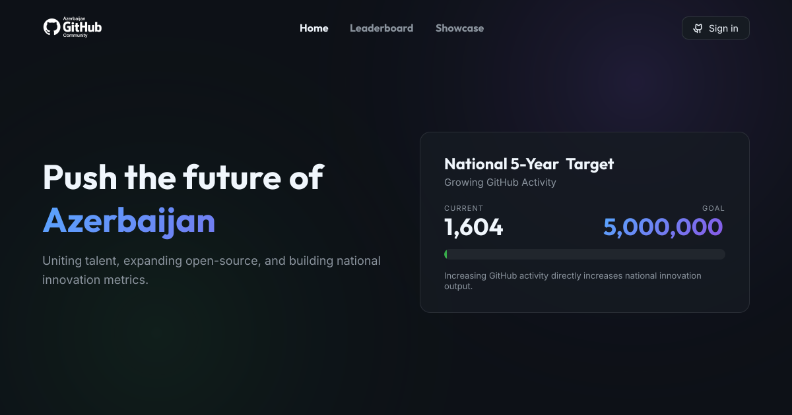

Welcome to the **Azerbaijan GitHub Community**'s first blog! This is a space where our community members can share their knowledge, tutorials, and insights about software development.

## What you can write about

Here are some ideas for blog posts:

- **Tutorials** — step-by-step guides on a technology you love
- **Project showcases** — deep dives into projects you've built
- **Career insights** — lessons learned from your developer journey
- **Open source contributions** — your experience contributing to OSS
- **Conference talks** — summaries of talks you've given or attended
- **Anything** — if it's about open source or programming, it belongs here

## How to contribute

Check out the [blog repository README](https://github.com/Azerbaijan-Git-Community/blog#readme) for the full guide. The short version:

1. Fork the [blog repository](https://github.com/Azerbaijan-Git-Community/blog)
2. Run `pnpm create-post` — it will ask for your username, slug, title, and tags, then scaffold everything for you
3. Write your post in the generated `index.mdx` and add a cover image
4. Open a pull request!

## Images

You can embed images stored in your `images/` folder:



Or use an external URL:


## Code examples

You can include code snippets with syntax highlighting:

```typescript title="hello.ts"
function greet(name: string): string {
  return `Hello, ${name}! Welcome to the community.`;
}

console.log(greet("Developer"));
```

## Tables

You can also use tables:

| Feature             | Status    |
| ------------------- | --------- |
| Blog posts          | Available |
| Syntax highlighting | Available |
| Image support       | Available |
| Code block titles   | Available |

We're excited to see what you write. Happy blogging!!!

Thanks for being part of the **Azerbaijan GitHub Community**!
